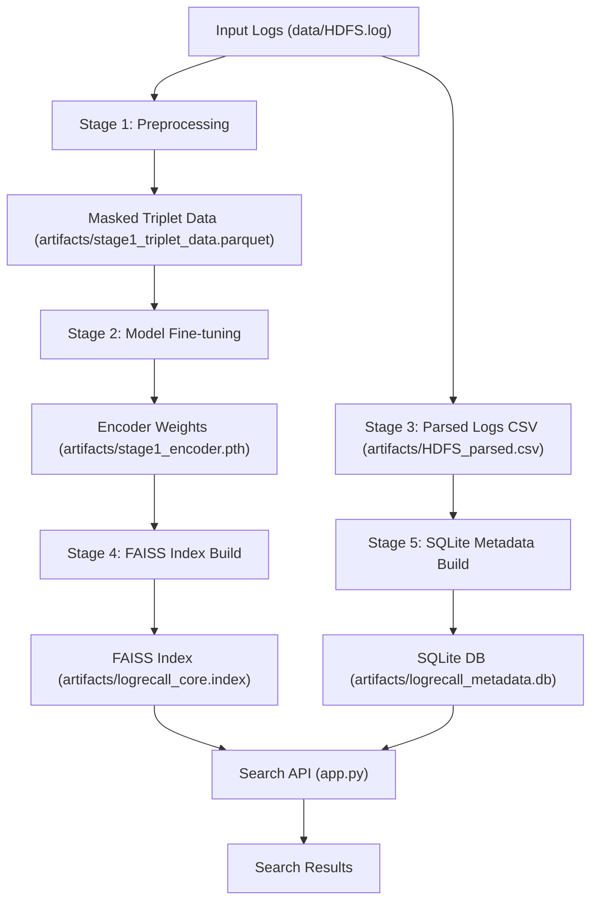

# LogRecall

## What is LogRecall?

LogRecall is a log template retrieval and evidence recall system for HDFS-style logs. It preprocesses raw logs, fine-tunes a sentence embedding model with triplet loss, builds a FAISS index over mask-normalized templates, and provides a FastAPI search endpoint for matching input log text against stored templates.

---

## Key Features

* **Masked Log Normalization**: Converts raw HDFS logs into normalized templates by removing block IDs, timestamps, IPs, and numeric values.
* **Contrastive Triplet Training**: Fine-tunes a SentenceTransformer model using triplet loss on deduplicated masked log phrases.
* **FAISS Retrieval Engine**: Builds an indexed similarity search over template embeddings for fast nearest-neighbor lookups.
* **SQLite Metadata Store**: Stores log metadata and template occurrences for ranked, explainable search results.
* **FastAPI Search Service**: Exposes a `/search` endpoint for embedding new log inputs and retrieving matched templates.

---

## System Architecture



---

## Quickstart

### Requirements

* Python 3.10+
* `pip` installed
* Optional GPU for faster model training and encoding

### Setup

```bash
cd /home/cry_more/ongoing/LogRecall
python -m venv venv
source venv/bin/activate
pip install -r requirements.txt
pip install -e .
```

### Configure

This project currently uses fixed relative paths in code:

* `data/HDFS.log`
* `data/anomaly_label.csv`
* `artifacts/` output directory

Make sure `data/HDFS.log` exists and `data/anomaly_label.csv` is present before running the full pipeline.

### Run

1. Run the full training and ingestion pipeline:

```bash
python src/pipeline/training.py
```

2. Start the FastAPI server:

```bash
uvicorn app:app --reload
```

3. Send a search request:

```bash
curl -X POST "http://127.0.0.1:8000/search" \
  -H "Content-Type: application/json" \
  -d '{"logs": "your log text here"}'
```

---

## Outputs

This project writes artifacts into `artifacts/`:

* `stage1_triplet_data.parquet` — masked log triplets for training
* `stage1_encoder.pth` — fine-tuned encoder model weights
* `HDFS_parsed.csv` — parsed log rows with templates and `blk_id`
* `logrecall_core.index` — FAISS similarity index
* `logrecall_metadata.db` — SQLite metadata database
* `template_dictionary.csv` — template-to-id mapping used by FAISS

---

## Core Logic

### 1. Log masking

`src/utils.py` defines `mask_log()`, which strips HDFS timestamp and block metadata, replaces block IDs with `<BLOCK_ID>`, IP addresses with `<IP>`, and numeric values with `<NUM>`.

### 2. Triplet training

`src/components/Model/model_trainer.py` loads masked logs from `artifacts/stage1_triplet_data.parquet` and trains a custom encoder using `TripletMarginWithDistanceLoss`.

### 3. Template parsing and ingestion

`src/components/Data_Ingestion/data_prepration.py` converts raw logs into rows containing:

* `raw_log`
* `template_log`
* `block_id`

`src/components/Data_Ingestion/sql_ingestion.py` stores these rows in SQLite and saves a `template_dictionary.csv` for later FAISS ingestion.

### 4. FAISS index build

`src/components/Data_Ingestion/faiss_ingestion.py` loads template text, encodes it with the fine-tuned encoder, and writes a FAISS `IndexFlatIP` index with template IDs.

### 5. Search inference

`src/pipeline/inference.py` loads the FAISS index, SQLite DB, and `SentenceTransformer` model to generate embeddings and lookup matches for new input logs.

---

## Project Structure

```
├── app.py
├── artifacts/
│   ├── HDFS_parsed.csv
│   ├── logrecall_core.index
│   ├── logrecall_metadata.db
│   ├── stage1_encoder.pth
│   └── template_dictionary.csv
├── data/
│   ├── HDFS.log
│   └── anomaly_label.csv
├── notebooks/
├── requirements.txt
├── setup.py
└── src/
    ├── __init__.py
    ├── exception.py
    ├── logger.py
    ├── utils.py
    ├── components/
    │   ├── __init__.py
    │   ├── Data_Ingestion/
    │   │   ├── data_prepration.py
    │   │   ├── data_preprocess.py
    │   │   ├── faiss_ingestion.py
    │   │   └── sql_ingestion.py
    │   └── Model/
    │       ├── model_builder.py
    │       ├── model_trainer.py
    │       └── triplet_dataset.py
    └── pipeline/
        ├── __init__.py
        ├── inference.py
        └── training.py
```

---

## Implementation Notes

* The model uses `sentence-transformers/all-MiniLM-L12-v2` as the base encoder.
* The FAISS index is built with cosine similarity (`IndexFlatIP`) and template IDs are stored in an ID map.
* SQLite stores raw logs and template IDs so results can include sample logs and occurrence counts.
* `mask_log()` is central: it normalizes logs before both training and inference.
* Training is done on CPU if CUDA is unavailable.

---

## Training Results

The model was fine-tuned using triplet loss.

```text
Train Loss: 0.003393430442570947
Validation Loss: 0.00005727660690629205
```

The trained encoder weights were saved to:

```text
artifacts/stage1_encoder.pth
```

The low training and validation loss indicates that the encoder successfully learned the triplet-based embedding objective during the initial training run. Further experiments with additional epochs and retrieval evaluation metrics can be used to assess generalization and improve template retrieval performance.


## Troubleshooting

* `ModuleNotFoundError` — run `pip install -e .` after activating the virtual environment.
* Missing artifacts — ensure `python src/pipeline/training.py` completed successfully before starting `uvicorn`.
* `data/HDFS.log` must exist and be readable.
* If the API fails on startup, confirm `artifacts/logrecall_metadata.db` and `artifacts/logrecall_core.index` exist.

---

## Contributing

1. Fork the repository.
2. Create a feature branch.
3. Open a pull request with a clear description.

Please keep changes limited to specific pipeline stages and add notes when modifying path constants or data formats.

---

## License

This project is released under the MIT License.
